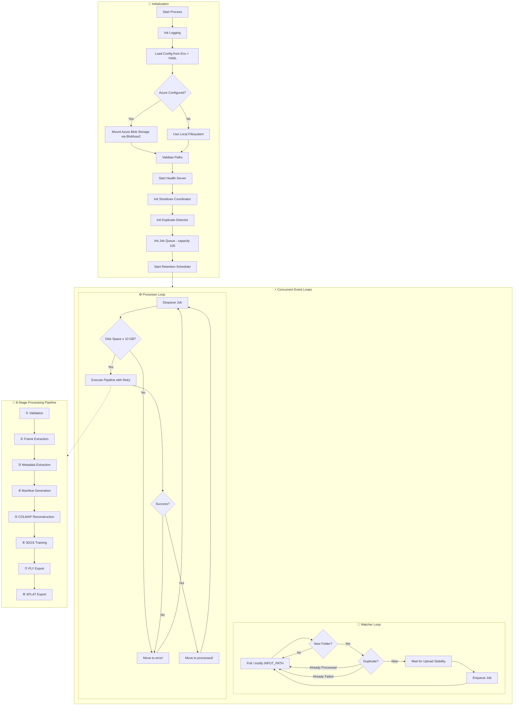
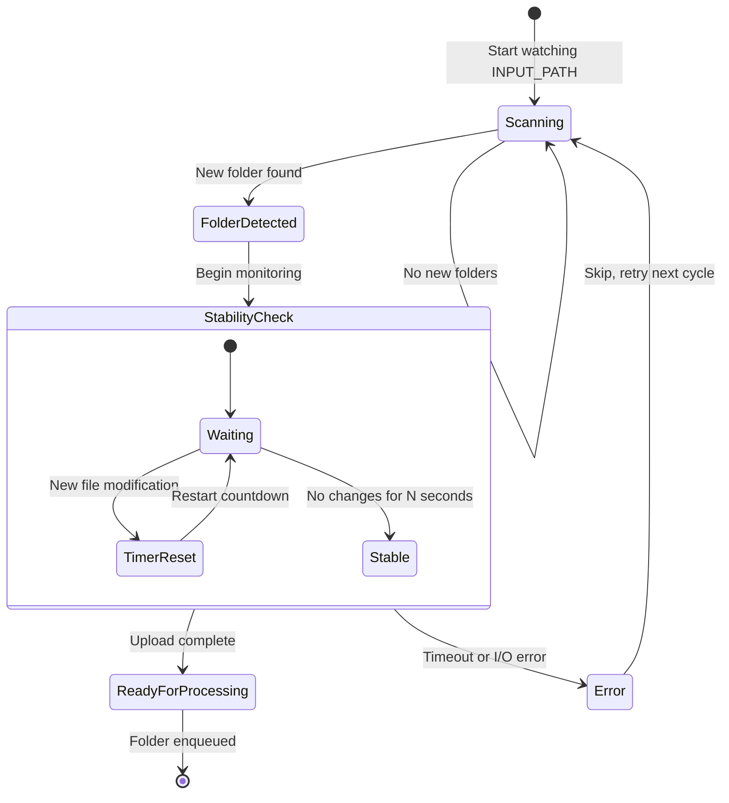
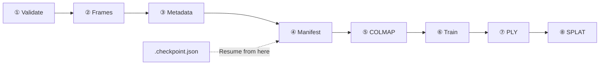
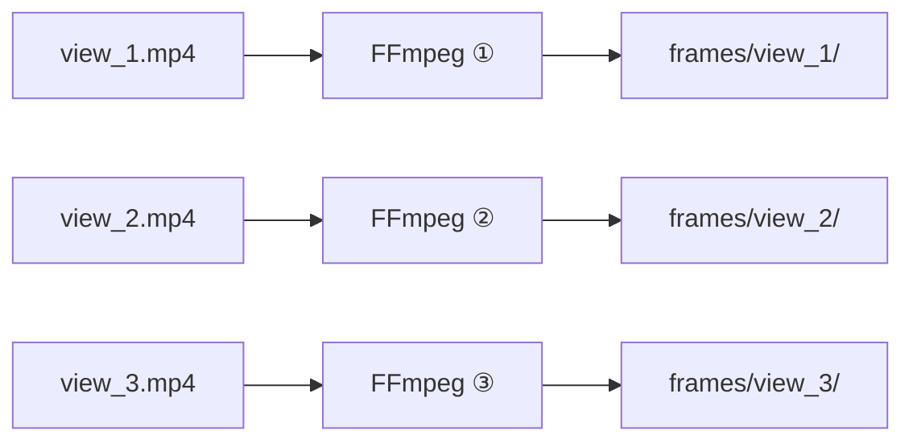
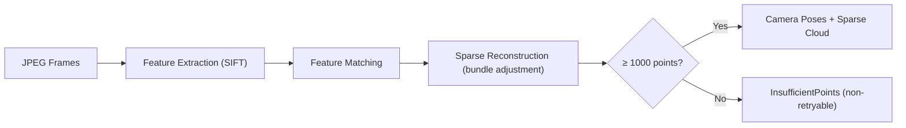
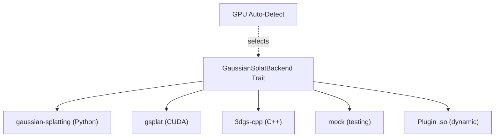
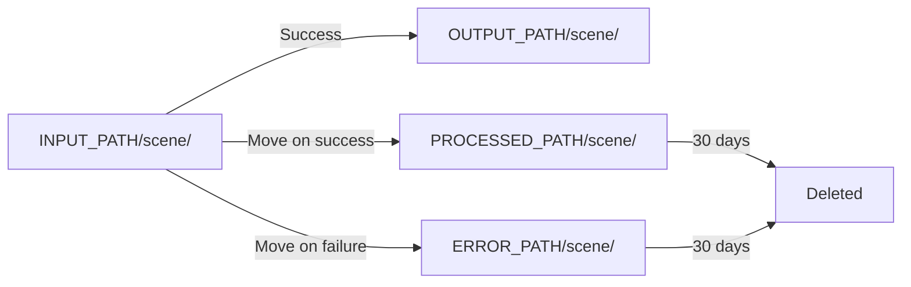
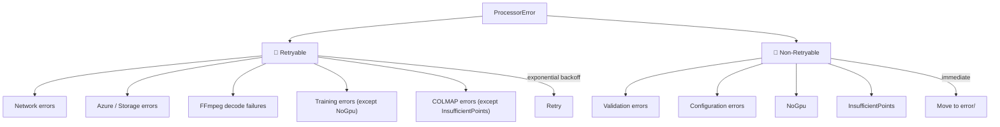

# 3DGS Video Processor — Process Flow

> **Audience:** Program Managers · Lead Developers · Core Developers
>
> For the rich visual version with interactive diagrams, see [Process Flow.html](./Process%20Flow.html).

---

## Table of Contents

1. [High-Level Overview](#1-high-level-overview)
2. [System Lifecycle Diagram](#2-system-lifecycle-diagram)
3. [Stage 0 — Initialization & Configuration](#3-stage-0--initialization--configuration)
4. [Stage 1 — File Watching & Folder Detection](#4-stage-1--file-watching--folder-detection)
5. [Stage 2 — Duplicate Detection & Job Queuing](#5-stage-2--duplicate-detection--job-queuing)
6. [Stage 3 — Job Execution & Retry Logic](#6-stage-3--job-execution--retry-logic)
7. [Stage 4 — Input Validation](#7-stage-4--input-validation)
8. [Stage 5 — Frame Extraction (FFmpeg)](#8-stage-5--frame-extraction-ffmpeg)
9. [Stage 6 — COLMAP Sparse Reconstruction](#9-stage-6--colmap-sparse-reconstruction)
10. [Stage 7 — 3DGS Training (Backend)](#10-stage-7--3dgs-training-backend)
11. [Stage 8 — Export (PLY & SPLAT)](#11-stage-8--export-ply--splat)
12. [Stage 9 — Post-Processing & Cleanup](#12-stage-9--post-processing--cleanup)
13. [Graceful Shutdown](#13-graceful-shutdown)
14. [Environment Variable Reference](#14-environment-variable-reference)
15. [Error Taxonomy & Retry Policy](#15-error-taxonomy--retry-policy)

---

## 1. High-Level Overview

The **3DGS Video Processor** is a long-running Rust service that watches a designated input directory for new multi-video scene folders. When a complete upload is detected, it automatically extracts frames, computes camera poses via structure-from-motion (COLMAP), trains a 3D Gaussian Splatting model, and exports the result in PLY and SPLAT formats.

The system is designed for **unattended, containerized operation** with Azure Blob Storage integration, automatic retries, checkpoint-based resumption, and graceful shutdown.

### End-to-End Pipeline

```
📂 Watch → ✅ Validate → 🎬 Extract → 📐 COLMAP → 🧠 Train → 💾 Export → 📦 Deliver
```

---

## 2. System Lifecycle Diagram



---

## 3. Stage 0 — Initialization & Configuration

**Entry point:** `src/main.rs` → `#[tokio::main] async fn main()`

### Startup Sequence

| Step | Action | Details |
|------|--------|---------|
| 1 | **Init Logging** | Structured `tracing` subscriber. Level via `LOG_LEVEL` (default: `info`). Credentials auto-redacted. |
| 2 | **Load Config** | Environment variables for operational params. YAML for training hyperparameters only. |
| 3 | **Azure Mount** *(optional)* | Authenticates (connection string / SAS / Managed Identity), mounts via Blobfuse2. |
| 4 | **Validate Paths** | Confirms INPUT, OUTPUT, PROCESSED, ERROR, TEMP directories exist. |
| 5 | **Health Server** *(optional)* | HTTP `GET /health` on port 8080. Enabled via `HEALTH_CHECK_ENABLED=true`. |
| 6 | **Init Subsystems** | Shutdown coordinator, duplicate detector, job queue (cap 100), retention scheduler. |
| 7 | **Spawn Loops** | Watcher Loop + Processor Loop as concurrent Tokio tasks. |

### Inputs / Outputs

| | Description |
|---|---|
| **Input** | Environment variables, `config.yaml`, Azure credentials |
| **Output** | Configured runtime, mounted storage, health endpoint, running event loops |

### Error Conditions

| Error | Severity |
|-------|----------|
| Missing required env vars | **Fatal** — process exits |
| Azure auth failure | **Fatal** if Azure configured |
| Blobfuse2 mount failure | **Fatal** if Azure configured |
| Path validation failure | **Fatal** — directories must exist |
| Port 8080 in use | Health server fails to bind |

> 📁 **Core Dev:** `src/main.rs:22-175` · `src/config/` · `src/azure/` · `src/logging/` · `src/health/` · `src/shutdown/`

---

## 4. Stage 1 — File Watching & Folder Detection

### How It Works

The watcher loop continuously monitors `INPUT_PATH` for new sub-folders:

1. **Detect New Folder** — Uses **inotify** (Linux kernel FS notifications) for near-instant detection. Falls back to **polling** (configurable interval, default 10s) for network-mounted filesystems (NFS, Blobfuse2).

2. **Wait for Upload Stability** — Monitors the folder for `UPLOAD_STABILITY_TIMEOUT_SECS` (default 60s) with no new file modifications. The timer **resets** each time a new file arrives, ensuring multi-video uploads are complete.



### Inputs / Outputs

| | Description |
|---|---|
| **Input** | `INPUT_PATH`, poll interval (10s), stability timeout (60s) |
| **Output** | Stable folder path ready for processing |

### Error Conditions

- `INPUT_PATH` becomes inaccessible (Azure unmount, permissions)
- Stability timeout never reached (continuously changing files)
- inotify watch limit exceeded → falls back to polling automatically

> 📁 **Core Dev:** `src/watcher/mod.rs` → `detect_new_folder()` · `src/watcher/stability.rs` → `wait_for_stability()`

---

## 5. Stage 2 — Duplicate Detection & Job Queuing

### Preventing Reprocessing

Before enqueuing, the system performs **filesystem-based deduplication** (no in-memory state required):

| Check | Result |
|-------|--------|
| Folder exists in `PROCESSED_PATH` | Skip — `AlreadyProcessed` |
| Folder exists in `ERROR_PATH` | Skip — `AlreadyFailed` |
| Neither | Create `QueuedJob` with UUID, enqueue to FIFO queue |

> 💡 **Design Decision:** Filesystem-based dedup makes the service **restart-resilient**. Container restarts are safe — no state is lost.

The job queue is bounded (capacity: 100) and applies backpressure when full.

> 📁 **Core Dev:** `src/processor/dedup.rs` · `src/processor/queue.rs`

---

## 6. Stage 3 — Job Execution & Retry Logic

### Processor Loop

Jobs are processed **one at a time**, sequentially:

1. **Dequeue** — 1-second timeout allows periodic shutdown-flag checks.
2. **Disk Space Check** — Requires ≥ 10 GB free on temp volume. Insufficient → move to `error/`.
3. **Execute with Retry** — Runs the 8-stage pipeline with exponential backoff.
4. **Move Result** — Success → `processed/`. Final failure → `error/`.

### Retry Strategy

```
Attempt 1 (immediate) → Fail → Wait 2s → Attempt 2 → Fail → Wait 4s → Attempt 3 → Fail → Wait 8s → Final Attempt → error/
```

- **Base delay:** 2s (configurable via `RETRY_BASE_DELAY_SECS`)
- **Max delay cap:** 60s (`RETRY_MAX_DELAY_SECS`)
- **Max retries:** 3 (`MAX_RETRIES`)
- Only **retryable** errors trigger retries (see [Error Taxonomy](#15-error-taxonomy--retry-policy))

### Checkpoint Resumption

A `.checkpoint.json` file is saved after each completed pipeline stage. If the service restarts, jobs resume from the last checkpoint rather than reprocessing from scratch.



> 📁 **Core Dev:** `src/processor/retry.rs` · `src/processor/job.rs` · `src/processor/progress.rs`

---

## 7. Stage 4 — Input Validation

**Pipeline Stage ①**

Validates all video files in the input folder before expensive processing begins. This is **non-retryable** — bad input won't improve on retry.

| Step | Check |
|------|-------|
| 1 | Discover video files (MP4, MOV, AVI, MKV, WebM) |
| 2 | Validate format, resolution, frame count, duration |
| 3 | Return validated `VideoInput` objects + metadata |

### Error Conditions (Non-Retryable)

- No video files found
- Unsupported format/codec
- Resolution below minimum
- Too few frames or too short duration
- Corrupted file (FFprobe cannot read)

> 📁 **Core Dev:** `src/validation/` · `src/extractors/metadata.rs`

---

## 8. Stage 5 — Frame Extraction (FFmpeg)

**Pipeline Stages ② + ③ + ④**

### Concurrent Multi-Video Processing

All videos are processed **concurrently** using `buffer_unordered()` bounded by CPU count:



### FFmpeg Command

```bash
ffmpeg -i video.mp4 -vf "fps=N" -frames:v M -q:v 2 -an -y frame_%06d.jpg
```

FFmpeg is a **blocking external process** — all calls are wrapped in `tokio::task::spawn_blocking` to avoid starving the async runtime.

### Sub-steps

1. **Frame Extraction** — FFmpeg decodes video → JPEG frame sequence
2. **Metadata Extraction** — FFprobe queries resolution, FPS, duration, GPS, camera info
3. **Manifest Generation** — Creates `manifest.json` with video entries, frame lists, camera intrinsics

### Inputs / Outputs

| | Description |
|---|---|
| **Input** | N video files, ExtractionOptions (FPS, max frames), optional `camera_intrinsics.yaml` |
| **Output** | FrameSet per video, VideoMetadata per video, `manifest.json` |

### Error Conditions (Retryable)

- FFmpeg binary not found
- Decode failure (corrupt segment)
- Disk full during frame write
- Insufficient permissions on temp directory

> 📁 **Core Dev:** `src/extractors/ffmpeg.rs` · `src/extractors/metadata.rs` · `src/processor/multi_video.rs` · `src/manifest/`

---

## 9. Stage 6 — COLMAP Sparse Reconstruction

**Pipeline Stage ⑤**

COLMAP is an industry-standard **Structure-from-Motion (SfM)** tool that computes 3D camera poses and a sparse point cloud from the extracted frames.

### 4-Step COLMAP Pipeline



| Step | Command | Description |
|------|---------|-------------|
| 1 | `colmap feature_extractor` | Detects SIFT keypoints in every frame |
| 2 | `colmap exhaustive_matcher` | Matches features between image pairs |
| 3 | `colmap mapper` | Bundle adjustment → camera poses + 3D points |
| 4 | *(validation)* | Verifies ≥ 1000 reconstructed 3D points |

### Matching Strategies

| Strategy | Use Case | Speed |
|----------|----------|-------|
| **Exhaustive** | All image pairs; most accurate | Slowest |
| **Sequential** | Adjacent frames only | Fastest |
| **Vocab Tree** | Vocabulary-based similarity | Balanced |

### Inputs / Outputs

| | Description |
|---|---|
| **Input** | Extracted JPEG frames, COLMAP binary path, matching strategy |
| **Output** | `ColmapOutput` (sparse model dir), camera poses, sparse 3D point cloud, `ColmapStats` |

### Error Conditions

| Error | Retryable? |
|-------|-----------|
| COLMAP binary not found | ✅ Yes |
| Feature extraction failure | ✅ Yes |
| GPU OOM during reconstruction | ✅ Yes |
| Insufficient points (< 1000) | ❌ **No** — bad input geometry |

> 📁 **Core Dev:** `src/colmap/mod.rs` · `src/colmap/runner.rs` · `src/colmap/models.rs`

---

## 10. Stage 7 — 3DGS Training (Backend)

**Pipeline Stage ⑥**

The core computational stage. A **pluggable backend** trains a 3D Gaussian Splatting model from the COLMAP sparse reconstruction and extracted frames.

### Backend Plugin Architecture



| Backend | Language | GPU Required | Notes |
|---------|----------|:---:|-------|
| `gaussian-splatting` | Python | Yes | Reference implementation |
| `gsplat` | Python/CUDA | Yes | Optimized, faster training |
| `3dgs-cpp` | C++ | Yes | High performance |
| `mock` | Rust | No | Testing only |

### Sub-steps

1. **Backend Selection** — From `BACKEND` env var, or auto-detected from GPU platform (CUDA/HIP/Metal)
2. **GPU Detection** — Validates GPU hardware compatibility
3. **Training** — Executes `backend.train()` with frames + COLMAP poses + YAML hyperparameters

### Inputs / Outputs

| | Description |
|---|---|
| **Input** | Extracted frames, COLMAP sparse model, `TrainingConfig` (from YAML), backend selection |
| **Output** | `BackendOutput` (trained model), training metrics |

### Error Conditions

| Error | Retryable? |
|-------|-----------|
| No GPU available | ❌ **No** (NoGpu) |
| GPU out of memory | ✅ Yes |
| Backend binary not found | ✅ Yes |
| Training divergence (NaN loss) | ✅ Yes |
| Plugin .so load failure | ✅ Yes |

> 📁 **Core Dev:** `src/backends/mod.rs` · `src/backends/registry.rs` · `src/backends/gpu_detect.rs` · `src/reconstruction/`

---

## 11. Stage 8 — Export (PLY & SPLAT)

**Pipeline Stages ⑦ + ⑧**

The trained model is exported in two formats:

| Format | Purpose | Details |
|--------|---------|---------|
| **PLY** | Industry standard 3D point cloud | Compatible with MeshLab, Blender, CloudCompare. Contains position, color (SH coefficients), opacity, and covariance per Gaussian. |
| **SPLAT** | Web-optimized binary | Compact format for real-time browser rendering. Quantized attributes, significantly smaller. |

Both files use timestamp-based filenames and are written to `OUTPUT_PATH`.

### Error Conditions

- Output directory write permission denied
- Disk full during export
- Model data corruption (serialization failure)

> 📁 **Core Dev:** `src/exporters/`

---

## 12. Stage 9 — Post-Processing & Cleanup

### Result Handling

| Outcome | Action |
|---------|--------|
| **Success** | Move input folder → `PROCESSED_PATH/scene/` |
| **Failure** | Move input folder → `ERROR_PATH/scene/` |
| **Temp Files** | Auto-cleaned via RAII (`TempDir` drops on scope exit) |

Name collisions are handled by appending timestamps.

### Retention Scheduler

A background task runs **every hour**, deleting folders in `processed/` and `error/` older than `RETENTION_DAYS` (default: 30).



> 📁 **Core Dev:** `src/processor/cleanup.rs` · `src/cleanup/`

---

## 13. Graceful Shutdown

The system handles **SIGTERM** and **SIGINT** for clean container orchestration:

| Step | Action | Timeout |
|------|--------|---------|
| 1 | Signal sets atomic `ShutdownFlag` | — |
| 2 | Watcher loop exits (checks flag each iteration) | — |
| 3 | Processor completes current job, then exits | — |
| 4 | Cleanup scheduler aborted | — |
| 5 | Azure containers unmounted (if applicable) | — |
| 6 | Health server stopped | — |
| **Guard** | **If all above exceeds timeout, force exit** | **5 minutes** |

> 📁 **Core Dev:** `src/shutdown/` · `src/main.rs:124-174`

---

## 14. Environment Variable Reference

### Required

| Variable | Description | Example |
|----------|-------------|---------|
| `INPUT_PATH` | Directory to watch for new scene folders | `/data/input` |
| `OUTPUT_PATH` | Directory for pipeline output (PLY, SPLAT) | `/data/output` |
| `PROCESSED_PATH` | Archive for successfully processed folders | `/data/processed` |
| `ERROR_PATH` | Archive for failed folders | `/data/error` |

### Optional (with Defaults)

| Variable | Default | Description |
|----------|---------|-------------|
| `TEMP_PATH` | `/tmp/3dgs-work` | Working directory for intermediate files |
| `CONFIG_PATH` | `/config/config.yaml` | Training hyperparameter YAML file |
| `BACKEND` | `gaussian-splatting` | 3DGS training backend |
| `LOG_LEVEL` | `info` | Logging verbosity |
| `MAX_RETRIES` | `3` | Retry attempts per job |
| `UPLOAD_STABILITY_TIMEOUT_SECS` | `60` | Upload stability wait |
| `POLL_INTERVAL_SECS` | `10` | Filesystem poll interval |
| `RETENTION_DAYS` | `30` | Days to keep old results |
| `RETRY_BASE_DELAY_SECS` | `2` | Initial backoff delay |
| `RETRY_MAX_DELAY_SECS` | `60` | Max backoff delay cap |
| `HEALTH_CHECK_ENABLED` | `false` | Enable HTTP health endpoint |
| `HEALTH_CHECK_PORT` | `8080` | Health endpoint port |
| `COLMAP_BIN` | `colmap` | COLMAP binary path |

### Azure (Optional)

| Variable | Description |
|----------|-------------|
| `AZURE_STORAGE_CONNECTION_STRING` | Full connection string (auth method 1) |
| `AZURE_STORAGE_ACCOUNT` | Storage account name |
| `AZURE_STORAGE_SAS_TOKEN` | SAS token (auth method 2) |
| `AZURE_USE_MANAGED_IDENTITY` | Use Managed Identity (auth method 3) |
| `AZURE_BLOB_CONTAINER_INPUT` | Blob container for input |
| `AZURE_BLOB_CONTAINER_OUTPUT` | Blob container for output |
| `AZURE_BLOB_CONTAINER_PROCESSED` | Blob container for processed |
| `AZURE_BLOB_CONTAINER_ERROR` | Blob container for errors |

---

## 15. Error Taxonomy & Retry Policy



| Error Type | Retryable | Rationale |
|-----------|:---------:|-----------|
| Network | ✅ | Transient connectivity issues |
| Azure/Storage | ✅ | Blob storage intermittent failures |
| FFmpeg | ✅ | Temporary decode issues |
| Training (general) | ✅ | GPU memory, transient failures |
| COLMAP (general) | ✅ | Resource contention |
| **Validation** | ❌ | Bad input won't improve |
| **Configuration** | ❌ | Missing env vars won't appear |
| **NoGpu** | ❌ | Hardware won't appear on retry |
| **InsufficientPoints** | ❌ | Scene geometry won't improve |

> 📁 **Core Dev:** `src/error.rs` → `ProcessorError` enum, `is_retryable()` · `src/processor/retry.rs`
